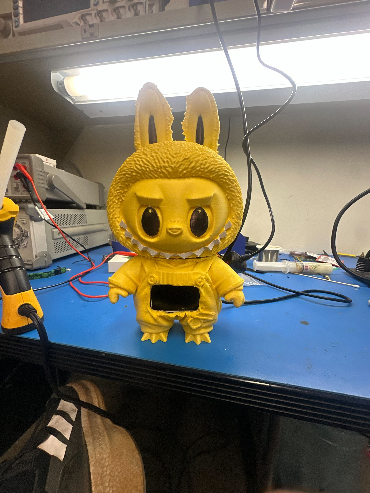
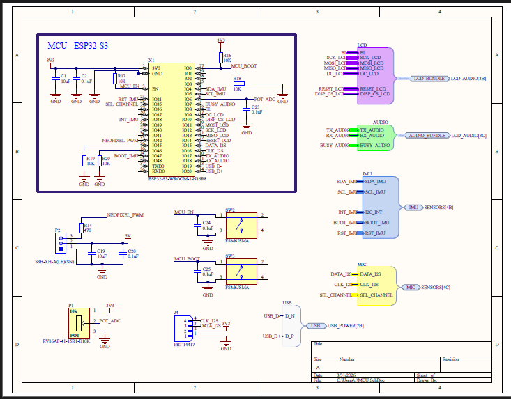
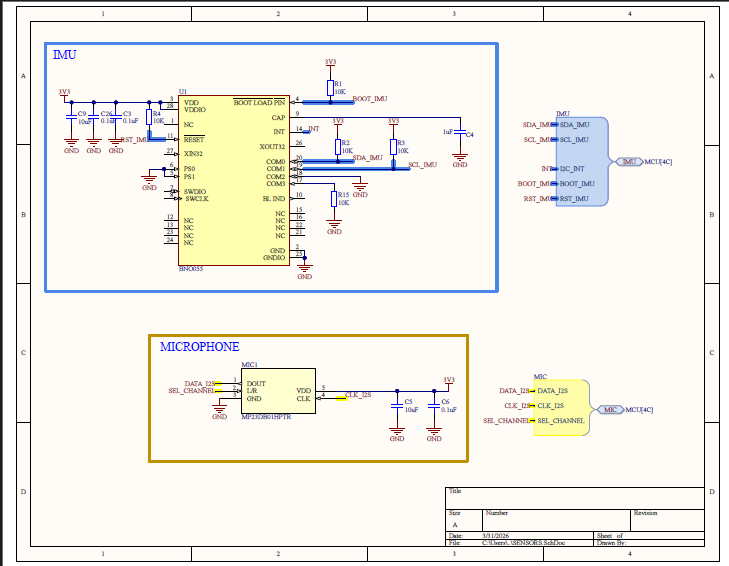
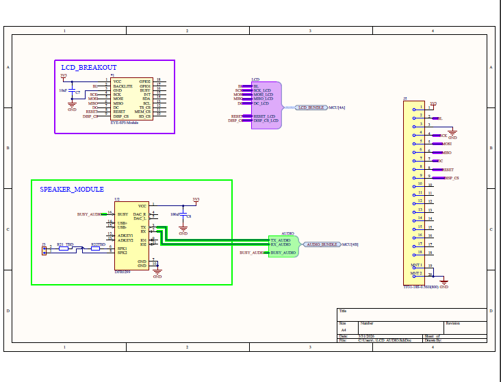
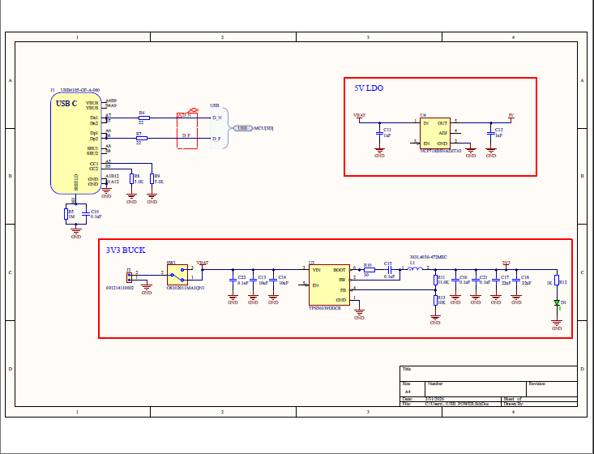

# Bop It — Labubu Edition

An ESP32-S3 based interactive reaction-time game ("Bop It" clone) built into a 3D-printed Labubu figure. Players respond to randomized voice prompts by twisting a knob, shaking the figure, or speaking into the microphone. Difficulty ramps with each round, reaction times shorten, and high scores persist across power cycles.

This is the final design archive for a junior-year ECE 1895 project (University of Pittsburgh, Spring 2026).

---



## Repository organization

The archive is split by engineering discipline. Each top-level folder is self-contained so that a reviewer (or future builder) can dive into one domain without needing the others.

```
Junior_Design_PCB/
├── README.md                  <- you are here
├── LICENSE
└── Theta_BopIt_Project_Files/
    ├── HARDWARE_DESIGN_FILES/   <- Altium PCB project (schematic, layout, BOM, gerbers, schematic page renders)
    ├── SOFTWARE_FILES/          <- ESP32-S3 firmware (Arduino .ino)
    └── ENCLOSURE_FILES/         <- Bambu Studio 3MF files for 3D-printed parts
```

No external simulation, FEA, or thermal tools were used on this project, so there is no separate `SIMULATION/` folder. Signal-integrity sanity checks were done by hand against the ESP32-S3 datasheet and the peripheral ICs' reference designs.

---

## Hardware

`Theta_BopIt_Project_Files/HARDWARE_DESIGN_FILES/` is an Altium Designer project. The board is a 4-layer PCB built around an ESP32-S3-WROOM-1-N16R8 module.

**Files of interest:**

- `Junior_Design_Bop_It.PrjPcbStructure` — Altium project file. Open this first.
- `LabubuPCB.PcbDoc` — PCB layout (4 layers).
- `MCU.SchDoc` — ESP32-S3 module, decoupling, boot strapping, USB, programming header.
- `USB_POWER.SchDoc` — USB-C input, 5V→3.3V regulation, protection.
- `LCD_AUDIO.SchDoc` — ILI9341 LCD interface and DFPlayer Mini audio interface.
- `Junior_Design_Bop_It.BomDoc` — bill of materials.
- `Gerber_Outputs_Labubu.zip` — fabrication-ready Gerbers (sent to JLCPCB).
- `Junior_Design_Bop_It.PDF` — full printed schematic (all sheets) for review without Altium.

### Schematic

The four sheets of the schematic are rendered below as PNGs so they can be reviewed directly on GitHub without opening the PDF.

**Sheet 1 — MCU + TOP LEVEL**



**Sheet 2 — IMU + MIC**



**Sheet 3 — LCD and audio**



**Sheet 4 — USB and power**



For the full PDF, see [`Junior_Design_Bop_It.PDF`](Theta_BopIt_Project_Files/HARDWARE_DESIGN_FILES/Junior_Design_Bop_It.PDF).

### Major peripherals

| Function           | Part                          | Interface |
|--------------------|-------------------------------|-----------|
| MCU                | ESP32-S3-WROOM-1-N16R8        | —         |
| Display            | ILI9341 2.4" TFT              | SPI       |
| IMU (shake detect) | BNO055                        | I²C       |
| Microphone         | PDM MEMS                      | I²S       |
| User input         | Rotary potentiometer          | ADC       |
| Audio playback     | DFPlayer Mini + speaker       | UART      |

The `__Previews/`, `Project Outputs for Junior_Design_Bop_It/`, `History/`, and `Project Logs for Junior_Design_Bop_It/` folders are Altium-generated and can be ignored unless debugging the design history.

---

## Software

`Theta_BopIt_Project_Files/SOFTWARE_FILES/` contains the firmware as a single Arduino sketch.

**Files of interest:**

- `labubu_bopit_1.ino` — full firmware (state machine, peripheral drivers, scoring, audio cues).

**Build environment:**

- Arduino IDE 2.x with the ESP32 board package (espressif/arduino-esp32).
- Board target: `ESP32S3 Dev Module`, Flash 16 MB, PSRAM `OPI PSRAM`.
- Required libraries: `Adafruit_GFX`, `Adafruit_ILI9341`, `Adafruit_BNO055`, `DFRobotDFPlayerMini`, `ESP_I2S` (built into the ESP32 core).

To flash: open the `.ino`, select the board settings above, plug in the unit over USB-C, and upload. The device boots into a splash screen on the LCD and waits for the start prompt.

---

## Enclosure

`Theta_BopIt_Project_Files/ENCLOSURE_FILES/` contains all 3D-printable parts as Bambu Studio `.3mf` project files. Print on any FDM printer; PLA at 0.2 mm layer height was used for the demo unit.

**Files of interest:**

- `labubu_scaled_hollow.3mf` — the main Labubu figure body (scaled up and hollowed to fit the PCB stack and speaker).
- `PotOutsidePlate_Actobotics_v04.3mf` — outer faceplate that the potentiometer mounts through.
- `PotInsidePlate_Actobotics_v04.3mf` — inner retainer that captures the pot against the outer plate.
- `lcd-bracket.3mf` — bracket that holds the ILI9341 module behind its cutout.
- `Knob-designv2.3mf` — knurled knob that presses onto the potentiometer shaft.

The Actobotics-named parts mount to a 1.5" Actobotics channel that runs through the figure as the internal chassis.

---

## Reproducing the build

If you want to rebuild this project from the archive:

1. **PCB** — open the Altium project in `HARDWARE_DESIGN_FILES/`, regenerate Gerbers (or use the included zip), and order from any 4-layer fab. Stuff per the BOM. Most parts are 0402/0603 hand-solderable; the ESP32-S3 module and DFPlayer are through-hole-friendly.
2. **Print** — slice each `.3mf` in `ENCLOSURE_FILES/` and print in PLA. The Labubu body is the long print (~14 hours).
3. **Flash** — open `SOFTWARE_FILES/labubu_bopit_1.ino` in the Arduino IDE, install the libraries listed above, and upload to the assembled board.
4. **Assemble** — mount the PCB to the Actobotics channel, fit the LCD into its bracket, press the knob onto the pot through the faceplates, drop the assembly into the Labubu shell, and screw the head back on.

---

## Notes

- The full git history of the hardware project lives in `HARDWARE_DESIGN_FILES/.git/` if you want to see how the schematic and layout evolved.
- The `CAMtastic1` file under `HARDWARE_DESIGN_FILES/` is an Altium CAM check of the Gerbers; not needed for fabrication, but useful for verifying drill alignment.
- This was a class project. The board has not been through EMC testing and should not be treated as a production design.
